# 📱 Laporan Praktikum Pemrograman Mobile  
## **Jobsheet 8: Aplikasi OCR (Optical Character Recognition)**  

### 👩‍💻 **Disusun Oleh:**  
**Queenadhynar Azarine Dwipa A.**  
NIM: 2341760109  
Kelas: SIB 3C  
Jurusan Teknologi Informasi  
Politeknik Negeri Malang  
Tahun Ajaran 2025/2026  

---

## 🧩 **Langkah-langkah Praktikum**

### **Langkah 1: Buat Proyek Baru**
Membuat proyek Flutter baru dengan nama **OCR App**  
📸 **Screenshot:**  
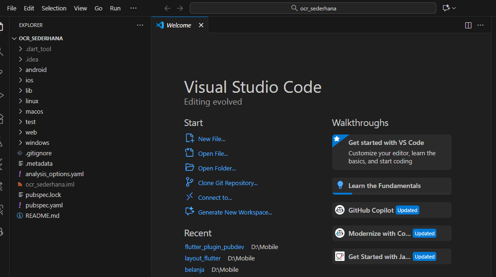

---

### **Langkah 2: Tambahkan Plugin**
Menambahkan dependensi **Google ML Kit OCR** ke dalam file `pubspec.yaml`:  
📸 **Screenshot:**  
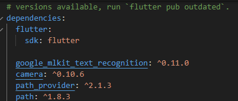

Kemudian menjalankan perintah pub get:  
📸 **Screenshot:**  
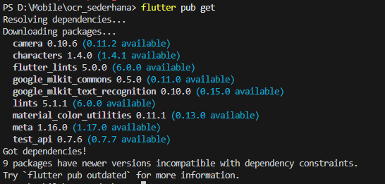

---

### **Langkah 3: Tambahkan Izin Kamera (Android)**
Buka file `AndroidManifest.xml` dan tambahkan izin kamera.  
📸 **Screenshot:**  
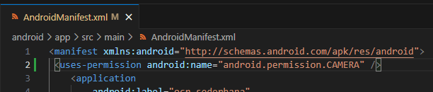

---

### **Langkah 4: Buat Struktur Folder**
Struktur folder di dalam proyek Flutter:  
📸 **Screenshot:**  
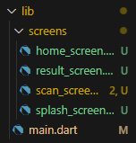

**File: lib/main.dart**  
📸 **Screenshot:**  
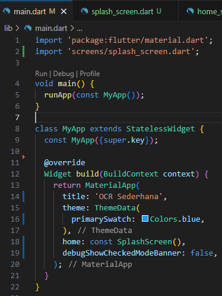

**File: lib/screens/splashscreen.dart**  
📸 **Screenshot:**  
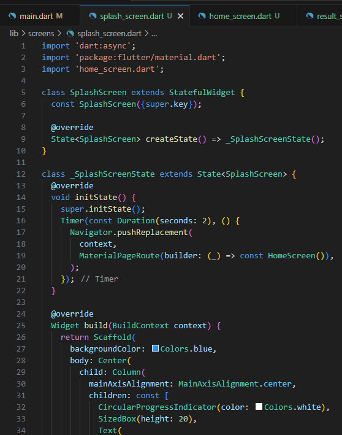

**File: lib/screens/homescreen.dart**  
📸 **Screenshot:**  
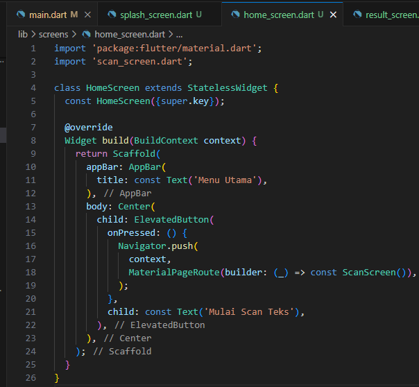

**File: lib/screens/scanscreen.dart**  
📸 **Screenshot:**  
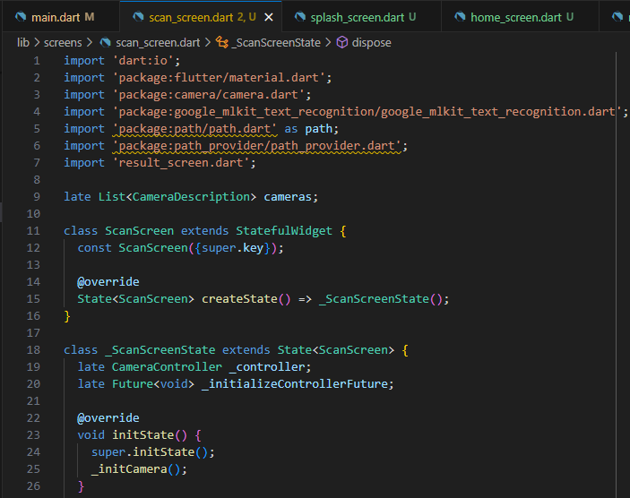

**File: lib/screens/resultscreen.dart**  
📸 **Screenshot:**  
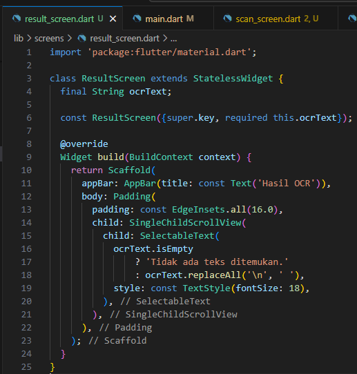

---

## 🧠 **Jawaban Tugas Praktikum**

### 1️⃣ Jalankan aplikasi di emulator atau HP.
📸 **Screenshot:**  
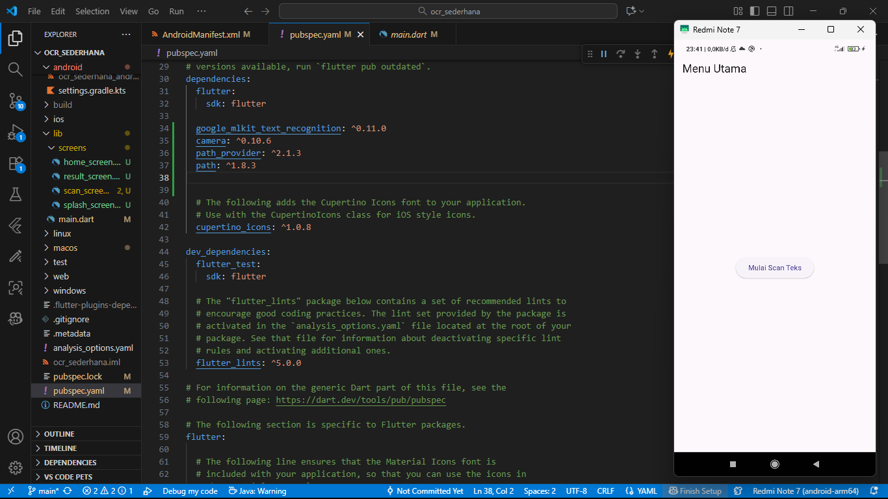

---

### 2️⃣ Lakukan scan terhadap teks cetak (misal: buku, koran, atau layar HP).
📸 **Screenshot:**  
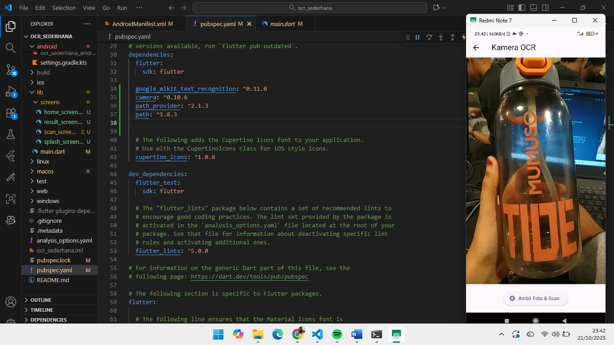

---

### 3️⃣ Amati hasil OCR yang muncul.
📸 **Screenshot:**  

---

### 4️⃣ Analisis Hasil OCR

a. **Apakah semua teks terbaca dengan akurat? Mengapa?**  
📸 **Screenshot:**  
  

Tidak semua teks terbaca dengan akurat.  
Tingkat akurasi OCR bergantung pada kualitas gambar, pencahayaan, kontras teks, serta jenis dan ukuran font.  
Jika gambar buram atau teks tidak jelas, hasilnya bisa kurang tepat.

---

b. **Sebutkan 2 contoh aplikasi nyata yang menggunakan OCR:**  
- **Google Lens** → membaca & menerjemahkan teks dari gambar.  
- **Microsoft Office Lens / Adobe Scan** → memindai dokumen dan menyimpannya dalam bentuk PDF editabel.

---

c. **Apa kegunaan fitur OCR dalam kehidupan sehari-hari?**  
OCR digunakan untuk mengubah teks dari gambar menjadi teks digital yang bisa disalin, diterjemahkan, atau disimpan.  
Contohnya digunakan untuk memindai dokumen, kwitansi, atau teks dari foto agar mudah diolah kembali.

---

## 🧾 **Kesimpulan**
Aplikasi OCR berbasis Flutter ini dapat mengenali teks dari gambar menggunakan **Google ML Kit**,  
namun akurasinya bergantung pada kualitas input.  
Fitur ini sangat bermanfaat dalam digitalisasi dokumen dan efisiensi pengolahan data teks.

---
